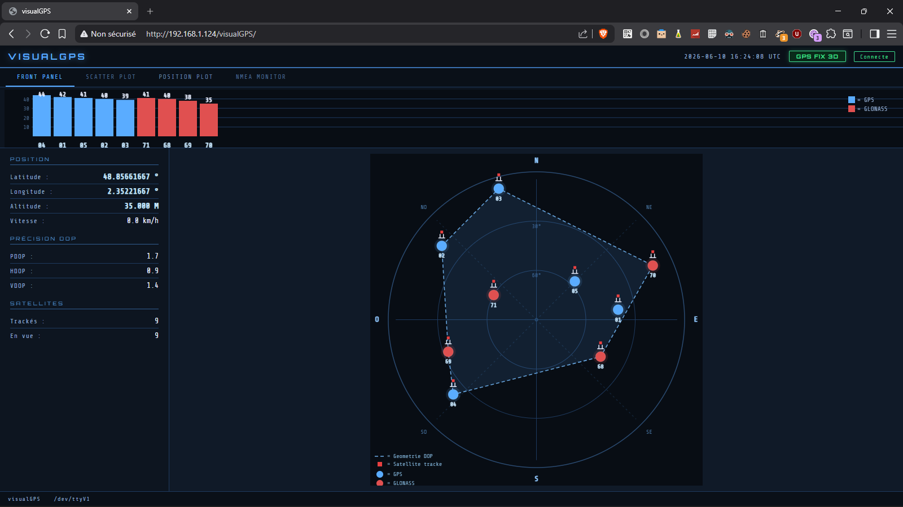
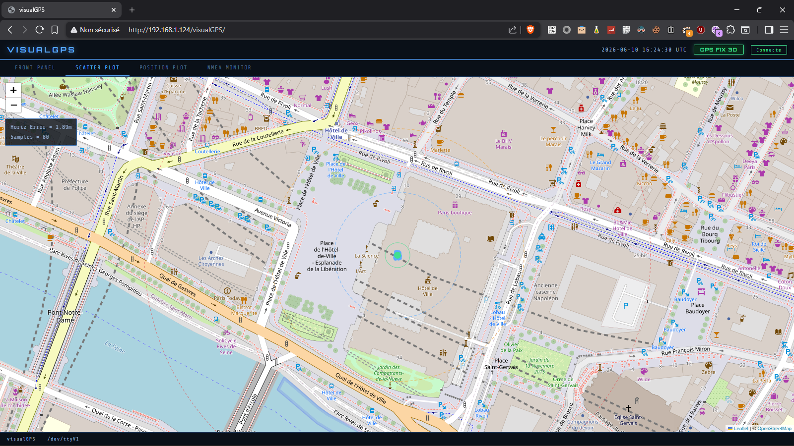
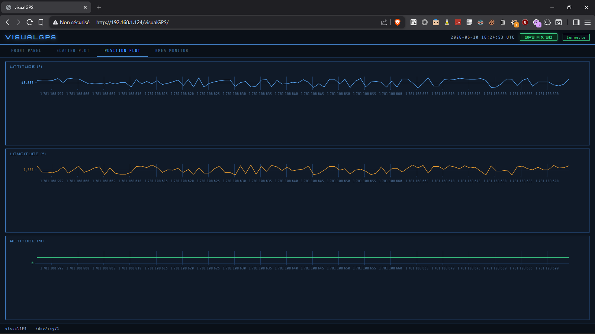
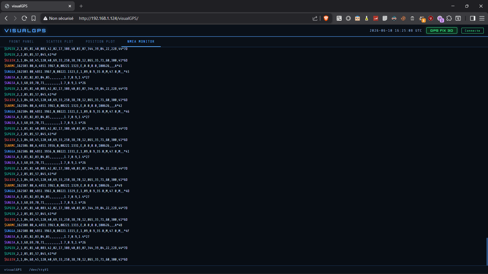

# visualGPS

Interface web temps réel pour récepteurs GPS NMEA, inspirée de VisualGPSView (Windows).
Conçue pour tourner sur n'importe quelle Debian sans dépendance à `gpsd` - lecture directe des trames NMEA sur le port série.


[](https://www.wtfpl.net/)

---

## Captures d'écran

|                                    |                                    |
| :--------------------------------: | :--------------------------------: |
|          |         |
| **Front Panel** - sky plot, rose des vents, barres de signal, DOP | **Scatter Plot** - nuage de points OpenStreetMap + cercles de précision |
|        |         |
| **Position Plot** - latitude / longitude / altitude sur 4h | **NMEA Monitor** - trames NMEA brutes colorées par type |

---

## Fonctionnalités

### Front Panel
- **Barres de signal satellites** : SNR en dB pour chaque satellite GPS (bleu) et GLONASS (rouge), satellites trackés vs en vue
- **Sky plot** :
  - Rose des vents 8 points (N/NE/E/SE/S/SO/O/NO)
  - Satellites positionnés par azimut et élévation
  - Symbole "antenne" + carré rouge pour les satellites effectivement trackés
  - Lignes de géométrie DOP (convex hull des satellites trackés)
  - Légende intégrée
- **Données temps réel** : latitude, longitude, altitude, vitesse, PDOP/HDOP/VDOP, nombre de satellites
- Rendu **HiDPI/Retina** : les canvas (barres de signal, sky plot) sont tracés à la résolution physique de l'écran

### Scatter Plot
- Carte **OpenStreetMap** via Leaflet.js
- Nuage de points de position (jusqu'à 90 000 échantillons, fenêtre glissante avec retrait effectif des plus anciens)
- Marqueur vert sur la position moyenne
- **Cercles de précision** : 10m, 50m, 100m, 200m, 500m (cercle supplémentaire automatique si l'erreur dépasse 500m)
- Overlay : erreur horizontale RMS et nombre d'échantillons

### Position Plot
- Graphes temps réel de latitude, longitude et altitude via **uPlot**
- Historique 4h à 1Hz (14 400 points), aligné sur la fenêtre conservée côté backend
- Rechargé automatiquement à la reconnexion WebSocket

### NMEA Monitor
- Affichage des trames NMEA brutes avec coloration par type :
  - `$GxGGA` en bleu, `$GxRMC` en orange, `$GxGSA` en violet/rouge, `$GxGSV` en cyan/vert, `$GxVTG` en ambre
- Défilement automatique

### Architecture
- **Pas de gpsd** : lecture directe du port série via `serialport` (Node.js)
- **WebSocket** : diffusion temps réel vers tous les clients connectés
- **Reconstruction par cycle NMEA complet** : les trames d'un même cycle (GGA, GSA, GSV, RMC...) sont parsées dans un buffer temporaire, puis basculées atomiquement dans l'état diffusé à la frontière de cycle (trame `GGA`). Aucun cycle partiel n'est jamais diffusé. Le compteur "en vue" est le total réel toutes constellations confondues. Particularité MT3333 (modules Adafruit) : les `GSV` ne sortent pas à chaque cycle (position à 1Hz, mais `GSV` tous les ~5 fixes, soit ~5s). Le set de satellites n'est donc **remplacé que sur les cycles porteurs de GSV** ; entre deux rafales, le dernier set connu est conservé (sinon la vue se viderait 4 cycles sur 5). L'anti-fantôme reste garanti : à chaque rafale GSV le set est reconstruit à neuf, donc un satellite qui décroche finit par disparaître.
- **3D Fix gate** : aucune coordonnée n'est diffusée ni enregistrée sans fix 3D confirmé (`$GxGSA` mode=3)
- **Détection de flux perdu** : si plus aucune trame NMEA valide n'arrive pendant 5s (récepteur débranché, antenne coupée...), l'état passe en `PAS DE SIGNAL` (champ `stale` à `true`) au lieu d'afficher indéfiniment la dernière position connue
- **Écoute localhost par défaut** : le backend WebSocket n'écoute que sur `127.0.0.1` (voir la section Configuration pour exposer le dashboard sur le LAN)
- Reconnexion automatique port série et WebSocket
- Arrêt propre SIGTERM/SIGINT (compatible systemd)

---

## Matériel testé

| Récepteur | Chipset | Constellations | Interface |
|-----------|---------|----------------|-----------|
| [Adafruit Ultimate GPS GNSS with USB](https://www.adafruit.com/product/4279) (PID 4279) | MediaTek MT3333 (PA1616D) | GPS + GLONASS | USB-C (CP2102N), vu en `/dev/ttyUSB0` |
| [Adafruit Ultimate GPS HAT / breakout PA1616D](https://learn.adafruit.com/adafruit-ultimate-gps-hat-for-raspberry-pi) | MediaTek MT3333 (PA1616D) | GPS + GLONASS | UART (`/dev/ttyAMA0`, `/dev/serial0`) |

Fonctionne avec tout récepteur émettant des trames NMEA 0183 standard à 9600 bauds.
visualGPS lit uniquement les trames NMEA ; le signal PPS (présent sur ces modules) n'est pas utilisé.

---

## Prérequis

- Debian 11 (Bullseye) ou supérieur - testé sur **Debian 13 (Trixie)**
- Node.js ≥ 16 (testé avec 20 LTS)
- Un serveur web (Apache2, ...) pour servir le frontend depuis `/var/www/html/`
- Un récepteur GPS connecté sur un port série

```bash
# Installer Node.js si absent
apt install nodejs npm

# Vérifier la version
node --version   # doit afficher v16.x ou supérieur
```

---

## Installation

```bash
git clone https://github.com/deuza/visualGPS.git
cd visualGPS

# Lancer le script d'installation interactif (en root)
sh install.sh
```

Le script va :
1. Vérifier Node.js
2. Détecter automatiquement le port série GPS parmi `/dev/ttyUSB0`, `/dev/ttyUSB1`, `/dev/ttyAMA0`, `/dev/ttyS0`, `/dev/serial0`
3. Demander confirmation du port et du port WebSocket (défaut : 8765), et synchroniser ce port dans le frontend déployé
4. Créer l'utilisateur système `visualgps` (groupe `dialout`)
5. Installer le backend dans `/opt/visualgps/`
6. Déployer le frontend dans `/var/www/html/visualGPS/`
7. Installer et activer le service systemd (écoute sur `127.0.0.1` par défaut)

```bash
# Démarrer le service
systemctl start visualgps

# Vérifier
systemctl status visualgps

# Logs en direct
journalctl -u visualgps -f
```

---

## Servir le frontend

Le frontend est un ensemble de fichiers statiques (HTML/CSS/JS), déployé par
`install.sh` dans `/var/www/html/visualGPS/`. N'importe quel serveur web
convient (Apache2, lighttpd...) : il suffit d'exposer ce répertoire.
Avec une configuration servant `/var/www/html` (cas par défaut d'Apache2), le dashboard est accessible sur
`http://<hôte>/visualGPS/`.

La page se connecte au backend WebSocket sur le même hôte, port `8765`
(`GPS_WS_PORT`). Le backend n'écoutant par défaut que sur `127.0.0.1`, le
dashboard fonctionne tel quel **depuis la machine elle-même**. Pour le
consulter depuis une autre machine du réseau, voir la note dans
Configuration (`GPS_WS_HOST`).

---

## Configuration

La configuration passe par les variables d'environnement de l'unité
systemd. Sur Debian, utiliser un drop-in (le fichier de référence n'est pas
écrasé, et `systemctl edit` recharge systemd automatiquement) :

```bash
systemctl edit visualgps
```

Ajouter les variables à modifier dans la section `[Service]`, par exemple :

```ini
[Service]
Environment="GPS_DEVICE=/dev/ttyAMA0"
```

| Variable | Défaut | Description |
|----------|--------|-------------|
| `GPS_DEVICE` | `/dev/ttyUSB0` | Chemin du port série GPS |
| `GPS_BAUD` | `9600` | Vitesse du port série |
| `GPS_WS_PORT` | `8765` | Port du serveur WebSocket |
| `GPS_WS_HOST` | `127.0.0.1` | Interface d'écoute du WebSocket. `127.0.0.1` = localhost uniquement. `0.0.0.0` = toutes interfaces (accès LAN) |

Appliquer ensuite (le `daemon-reload` est automatique avec `systemctl edit`) :

```bash
systemctl restart visualgps
```

> Si `GPS_WS_PORT` est modifié après l'installation, reporter le même port
> dans le frontend : la ligne `const WS_PORT = ...;` en tête de
> `/var/www/html/visualGPS/js/app.js`.

> **Exposition réseau.** Le flux diffusé contient la **position GPS en
> temps réel** (localisation physique de l'antenne) et le NMEA brut. Le
> backend n'écoute par défaut que sur `127.0.0.1`. Passer
> `GPS_WS_HOST=0.0.0.0` rend le dashboard accessible depuis tout le réseau
> local : dans ce cas, filtrer le port `8765` au firewall (c'est un
> listener réseau distinct du serveur web).

---

## Désinstallation

En root :

```bash
systemctl stop visualgps
systemctl disable visualgps
rm -f  /etc/systemd/system/visualgps.service
rm -rf /etc/systemd/system/visualgps.service.d   # drop-in créé par systemctl edit
systemctl daemon-reload
rm -rf /opt/visualgps
rm -rf /var/www/html/visualGPS
userdel visualgps
```

---

## Structure du projet

Avant installation : 

```
visualGPS/
├── install.sh                  # Script d'installation interactif
├── backend/
│   ├── server.js               # Backend Node.js : NMEA parser + WebSocket
│   ├── visualgps.service       # Unit systemd de référence (install.sh la régénère)
│   └── package.json            # Dépendances : serialport 13, ws 8
└── frontend/
    ├── index.html              # Interface principale (4 onglets)
    ├── css/
    │   └── style.css           # Thème sombre adaptatif
    └── js/
        ├── app.js              # Logique principale + WebSocket client
        ├── satbars.js          # Canvas2D : barres de signal satellites
        ├── skyplot.js          # Canvas2D : sky plot + rose des vents + DOP
        └── scatter.js          # Leaflet.js : scatter plot sur carte OSM
```

Post installation :

```
/var/www/html/visualGPS/
├── index.html
├── js/
│   ├── app.js
│   ├── satbars.js
│   ├── scatter.js
│   └── skyplot.js
└── css/
    └── style.css
```

---

## Dépendances

### Backend (npm)
| Paquet | Version | Rôle |
|--------|---------|------|
| `serialport` | 13.0.0 | Lecture port série |
| `ws` | 8.21.0 | Serveur WebSocket |

> `server.js` importe aussi `@serialport/parser-readline` (`ReadlineParser`),
> tiré comme dépendance transitive de `serialport` 13 et hoisté par npm :
> `npm install` suffit. Il peut être ajouté explicitement aux `dependencies`
> pour se prémunir d'un futur découplage côté `serialport`.

### Frontend (CDN)
| Bibliothèque | Version | Rôle |
|--------------|---------|------|
| [uPlot](https://github.com/leeoniya/uPlot) | 1.6.32 | Graphes temps réel latitude/longitude/altitude |
| [Leaflet.js](https://leafletjs.com/) | 1.9.4 | Carte interactive OpenStreetMap |
| [Share Tech Mono](https://fonts.google.com/specimen/Share+Tech+Mono) | - | Police monospace |
| [Orbitron](https://fonts.google.com/specimen/Orbitron) | - | Police titres |

Tuiles cartographiques : © [OpenStreetMap](https://www.openstreetmap.org/copyright) contributors.

> **Note vie privée / chaîne d'approvisionnement.** Le frontend charge uPlot
> et Leaflet depuis des CDN tiers (unpkg, jsDelivr) et les polices depuis
> Google Fonts (`@import` dans `style.css`) ; le navigateur du client expose
> donc son IP et son User-Agent à ces tiers, et les fichiers ne sont pas
> épinglés par un hash. Pour un déploiement durci : vendoriser ces ressources
> en local, ou a minima ajouter des attributs **SRI** (`integrity=...`).

---

## Notes techniques

### Pourquoi sans gpsd ?

`gpsd` ajoute une couche d'abstraction utile pour des setups complexes multi-récepteurs, mais introduit une dépendance système supplémentaire et une configuration non triviale. Pour un récepteur unique sur un serveur dédié, lire directement le NMEA depuis Node.js via `serialport` est plus simple, plus léger et plus facile à déboguer.

### Reconstruction par cycle (double buffer)

Un cycle NMEA à 1Hz est une rafale de trames (`GGA`, `GSA`, `GSV`, `RMC`...) émises coup sur coup. Plutôt que de muter l'état diffusé trame par trame (ce qui expose des états intermédiaires incohérents et laisse traîner des satellites de cycles précédents), le backend parse chaque cycle dans un buffer temporaire et bascule cet état dans la structure diffusée **en une fois**, à l'arrivée de la trame `GGA` qui ouvre le cycle suivant. Conséquences : `satsInView` est le total réel toutes constellations confondues (et non le compte de la dernière constellation reçue), et le flag `tracked` de chaque satellite est recalculé au commit, indépendamment de l'ordre d'arrivée des trames `GSA`/`GSV`.

Sur les puces MT3333 (modules Adafruit), la position sort à 1Hz mais les `GSV` ne sont émises que tous les ~5 fixes (~5s). Le backend ne remplace donc le set de satellites **que sur les cycles qui apportent des GSV** ; sinon il conserve le dernier set connu, faute de quoi la vue se viderait 4 cycles sur 5. L'anti-fantôme reste assuré : à chaque rafale GSV le set est reconstruit à neuf, donc un satellite qui décroche finit par disparaître.

### Validation 3D Fix

Le backend maintient l'état du fix en analysant les sentences `$GxGSA` (champ mode : 1=no fix, 2=2D, 3=3D) et `$GxRMC` (champ status : A=valid, V=void). Aucune coordonnée n'est diffusée aux clients tant que `fixMode !== 3`.

### Géométrie DOP (sky plot)

Les lignes de géométrie DOP sont calculées via un **convex hull** (algorithme d'Andrew, monotone chain) sur les coordonnées canvas des satellites trackés. C'est une représentation **purement visuelle** de la répartition géométrique des satellites utilisés pour le calcul de position : une bonne répartition (hull large) correspond à un PDOP bas. La valeur de DOP réellement affichée, elle, vient directement des trames `$GxGSA`.

### Rendu HiDPI

Les deux canvas (barres de signal, sky plot) dimensionnent leur backing store à `devicePixelRatio` près et remettent le repère de dessin en pixels CSS via `setTransform`. Le rendu reste donc net sur écran Retina / haute densité, sans flou de mise à l'échelle. uPlot gère le HiDPI nativement.

---

## Cas d'usage

- **Surveillance de position d'un récepteur statique** : un récepteur fixe (station, point géodésique, antenne fixe) émet en continu ; le Scatter Plot matérialise alors la dispersion du fix autour de la position vraie et donne une erreur horizontale RMS.
- **Suivi mobile** : embarqué sur un véhicule, le Position Plot et la carte tracent le déplacement en temps réel.
- **Diagnostic d'antenne / de réception** : le Front Panel (barres de signal, sky plot, DOP) permet de juger rapidement de la qualité de réception et de la géométrie satellitaire.

---

## Licence

[](https://www.wtfpl.net/)

WTFPL (Do What The Fuck You Want To Public License), version 2 - voir [LICENSE](LICENSE).
Identifiant SPDX : `WTFPL`.

---

## Remerciements

- [VisualGPSView](https://www.visualgpsview.com/) pour l'inspiration de l'interface
- [uPlot](https://github.com/leeoniya/uPlot) - graphes ultra-performants
- [Leaflet.js](https://leafletjs.com/) - cartographie interactive
- [OpenStreetMap](https://www.openstreetmap.org/) - données cartographiques libres
- [Adafruit](https://www.adafruit.com/) - hardware GPS de qualité
